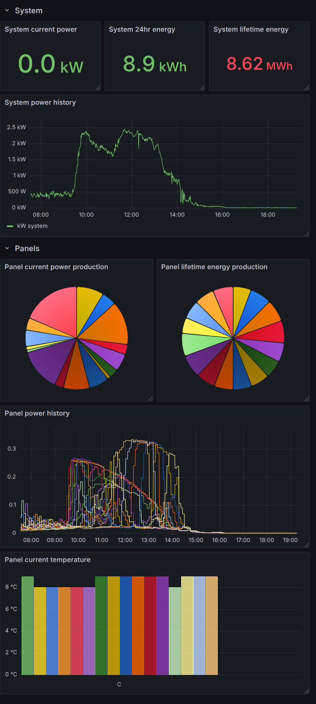

# simple_pvs6_monitor

A deliberately simple Python program to extract info from a SunPower PVS6 solar monitor drawing heavily upon [Sun Strong's more powerful implementation](https://github.com/SunStrong-Management/pypvs).

Requirement:
* `pip install aiohttp influxdb_client`

Also included are a basic script for pushing data to `influxdb` and a `grafana` dashboard.

